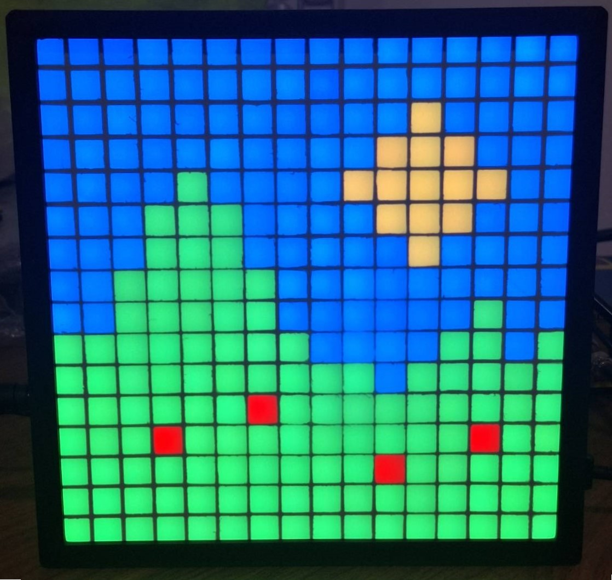
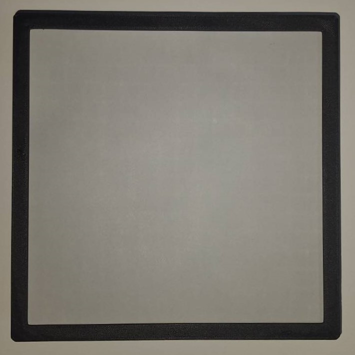
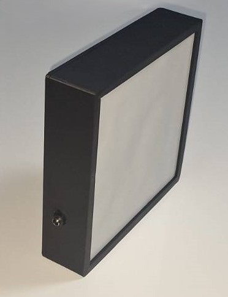
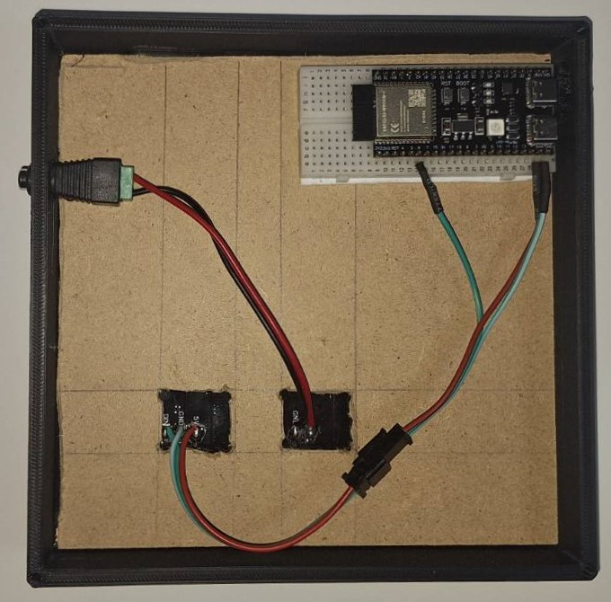
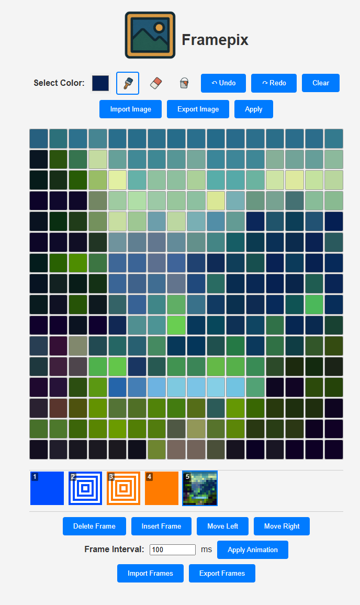

<center>

<h1>FramePix</h1>
</center>

A smart LED matrix display powered by ESP32S3, featuring WiFi connectivity and web-based LED matrix animation designer.

<table>
  <tr>
    <td> </td>
    <td> </td>
   </tr> 
    <td> </td>
    <td> </td>
   <tr>
  </td>
  </tr>
</table>



## Features

- 16x16 WS2812B LED matrix display
- WiFi connectivity with web-based provisioning
- mDNS service
- Web-based interface for creating and managing LED designs and animations
- Support for importing/exporting images for designs and animations
- Modern C++ component architecture

## Hardware

- ESP32S3 Dev Board
- 16x16 WS2812B LED Matrix
- 5V, 3A power supply for the Matrix
- 3D Printed Case: [Download from Thingiverse](https://www.thingiverse.com/thing:6492828)

## Software Architecture

The project is built with a modular C++ architecture:

- `WifiManager`: Handles WiFi connectivity (Station/AP modes)
- `LedMatrix`: Controls LED matrix operations
- `Animator`: Manages animation sequences
- `HttpServer`: Web interface server
- `SPIFFS`: File system for persistent storage

The code can use a bit of clean-up and refactoring.
There is a use of heap-allocated objects (`std::string`, `std::function`), which is not a good practice in some cases.
But, overall, the code is good enough for this project.

## Setup

1. Install ESP-IDF
2. Install esp-clang for development tools:
   ```bash
   idf_tools.py install esp-clang
   ```
3. Clone this repository
4. Build and flash the firmware:
   ```bash
   idf.py build
   idf.py -p (PORT) flash
   ```

## Usage

1. Power on the device
2. Connect to the FramePix AP network
3. Open the web interface for web provisioning at `http://framepix.local`, or `http://192.168.4.1`
4. Configure WiFi credentials
5. Once connected to your network, access the interface at `http://framepix.local`

## Development

The project uses ESP-IDF and uses modern C++ features.
Key components are located in the `components` directory.

## Future feature list

There are multiple ideas that can be implemented to make the project even better:

- [ ] Persistent storage of designs and animations
- [ ] Gallery of designs and animations
- [ ] LED matrix overlays
  - [ ] Time overlay
  - [ ] Date overlay
- [ ] Temperature sensor
- [ ] Auto wifi reconnect to station